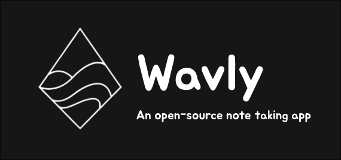

Open Source Note taking app designed for the community

# 🚀 Getting Started

## Prerequisites

- [Astro](https://astro.build/) and [Typescript](https://www.typescriptlang.org/) basic understanding
- [NodeJS](https://nodejs.org/en) LTS
- [Pnpm](https://pnpm.io/) (For building and running the app locally)

## Installation and Setup

- **Clone the repository:**

  ```bash
  git clone https://github.com/wavly/notes
  ```

- **Navigate to the project directory:**

  ```bash
   cd notes
   ```

- **Install dependencies:**

  ```bash
  pnpm install
  ```

## Development

- `pnpm dev` To start the dev server
- `pnpm build` To build the static site into `./build`
- `pnpm preview` To preview the builded site in `./build` ( no dev environment )
